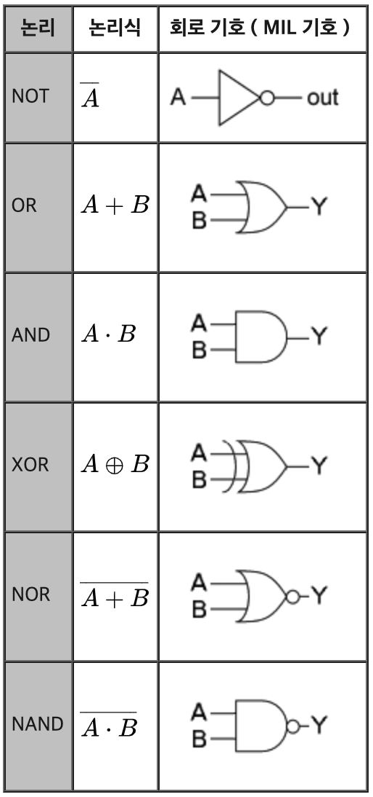

## DMA (Direct Memory Access)
* 중앙처리장치의 입출력 명령을 직접 수행해서 주기억장치와 입출력장치 사이에 데이터를 전달하도록 하는 입출력 제어기
* 입출력 장치가 직접 주기억장치를 접근하여 Data Block을 입출력하는 방식으로, 입출력 전송이 CPU의 레지스터를 경유하지 않고 수행된다.
* 입출력 자료 전송 시 CPU를 거치지 않기 때문에 CPU의 부담없이 빠른 데이터 전송 가능
* CPU는 I/O에 필요한 정보를 DMA 제어기에 알려서 I/O 동작에 더 이상 간섭하지 않고 다른 프로그램을 할당하여 수행한다.
* 인터럽트 신호를 발생시켜 CPU에게 입출력 종료를 알린다.
* Cycle Steal 방식을 이용하여 데이터 전송
* CPU와 DMA 제어기는 메모리와 버스를 공유한다.

### DMA 제어기의 구성요소
* 인터페이스 회로 : CPU와 입출력 장치와의 통신 담당
* 주소 레지스터 및 주소 라인 : 기억 장치의 위치 지정을 위한 번지 기억 및 전송
* 워드 카운트 레지스터 : 전송되어야 할 워드의 수 기억
* 제어 레지스터 : 전송 방식 결정
* 데이터 레지스터 : 전송에 사용할 자료나 주소를 임시로 기억하는 버퍼 역할

### DMA 데이터 전송 절차
1. 인터럽트
2. 버스 사용 요구
3. 버스 사용 허가
4. 데이터 전송

 

## Cycle Steal
* 데이터 채널(DMA 제어기)과 CPU가 주기억장치를 동시에 액세스할 때 우선순위를 데이터 채널에 주는 방식
* 한 번에 한 데이터 워드를 전송하고 버스의 제어를 CPU에게 돌려준다.
* 입출력 자료의 전송을 빠르게 처리해준다.
* Cycle Steal 시, CPU는 메모리 참조가 필요 없는 오퍼레이션을 계속 수행한다.

 

## 메모리 인터리빙
* 단위 시간에 여러 메모리의 접근이 가능하도록 병행 접근하는 기법
* CPU가 각 모듈로 전송할 주소를 교대로 배치한 후 차례대로 전송하여 여러 모듈을 병행 접근하는 기법
* CPU가 버스를 통해 주소를 전달하는 속도는 빠르지만 메모리 모듈의 처리 속도가 느리기 때문에 병행 접근 가능
* 캐시 기억장치, 고속 DMA 전송 등에서 많이 사용된다.

 

## PC, MAR, MBR
* 워드의 개수 : 1024 = 2^10 = MAR의 크기 = PC의 크기 = 10
* 워드의 크기 : 16(bit) = MBR의 크기

 

## 명령문 구성
* 0 주소 명령어 : 스택
* 1 주소 명령어 : 누산기(AC)
* 2 주소 명령어 : 범용 레지스터
* 3 주소 명령어 : 범용 레지스터

 

## 부동 소수점 수 표현
    | Sign | 지수부 | 가수부 |  
* Sign : 양수 = 0, 음수 = 1
* 지수부 : 8bit
* 가수부 : 23bit
* 표현범위 : 2^-127 ~ 2^ 128

### 부동 소수점의 나눗셈 
1. 0 여부를 조사한다.
2. 레지스터를 초기화시키고 부호를 결정한다.
3. 피젯수를 위치 조장한다.
4. 지수의 뺄셈을 한다.
5. 가수의 나눗셈을 한다.

 

## Flynn의 병렬 컴퓨터 분류
* **SISD**(Single Instruction stream Single Data stream) : 한 개의 명령으로 한 개의 자료 처리
* **SIMD**(Single Instruction stream Multi Data stream) : 한 개의 명령으로 여러 자료 처리
* **MISD**(Multi Instruction stream Single Data stream) : 여러 개의 명령으로 한 개의 자료 처리
* **MIMD**(Multi Instruction stream Multi Data stream) : 여러 개의 명령으로 여러 개의 자료 처리

 

## 명령어의 구성
### 연산자부(OP-Code, Operation Code)
* 연산자 부는 수행해야 할 동작에 맞는 연산자를 표시한다.
* 연산자부의 크기(비트수)는 표현할 수 있는 명령의 종류를 나타내는 것으로, n Bit면 최대 2^n개의 명령어를 사용할 수 있다.
* 연산자부에는 주소부의 유효 주소가 결정되는 방법을 지정하기 위한 모드 비트를 추가하기도 한다.

### 자료부 (Operand, 주소)
* 실제 데이터에 대한 정보를 표시하는 부분
* 기억장소의 주소, 레지스터 번호, 사용할 데이터등 표시
* 주소부의 크기는 메모리 용량과 관계가 있다. (주소부가 16Bit라면 2^16 = 64KB의 메모리를 주소로 지정하여 사용할 수 있다.)

 

## CPU의 메이저 상태
* **인출 단계(Fetch Cycle)** : 주기억장치에서 명령어를 가져와 해독
* **간접 단계(Indirect Cycle)** : 해독한 명령이 간접주소일 때 자료가 있는 주소를 계산하기 위해 수행
* **실행 단계(Execute Cycle)** : 실행. 실행을 마친 후 인터럽트 요청 검사
* **인터럽트 단계(Interrupt Cycle)** : 인터럽트 요청이 있었으면 수행

 

## 메모리 IC
* 주소 : 워드의 개수
* data : 워드의 크기

 

## Micro Cycle Time 부여 방식
### 동기 고정식(Synchronous Fixed)
* 모든 마이크로 오퍼레이션의 동작시간이 같다고 가정하여 CPU Clock의 주기를 Micro Cycle Time과 같도록 정의하는 방식
* 모든 마이크로 오퍼레이션 중에서 수행시간이 가장 긴 마이크로 오퍼레이션의 동작 시간을 Micro Cycle Time으로 정한다.
* 여러 종류의 마이크로 오퍼레이션의 수행 시 CPU 사이클 타임이 실제적인 오퍼레이션 시간보다 길며, 중앙처리장치의 시간 이용이 비효율적
* 모든 마이크로 오퍼레이션의 동작시간이 비슷할 때 유리한 방식
#
### 동기 가변식(Synchronous Variable)
* 수행 시간이 유사한 Micro Operation끼리 그룹을 만들어, 각 그룹별로 서로 다른 Micro Cycle Time을 정의하는 방식
* 동기 고정식에 비해 CPU 시간 낭비를 줄일 수 있지만, 제어기의 구현은 조금 복잡하다.
* 마이크로 오퍼레이션의 동작시간이 차이가 날 때 유리하다.(정수배)
#
### 비동기식(Asynchronous)
* 모든 마이크로 오퍼레이션에 대해 서로 다른 Micro Cycle Time을 정의하는 방식
* CPU의 시간 낭비는 전혀 없으나, 제어기가 매우 복잡해지기 때문에 실제로는 거의 사용되지 않음

 

## 주소 지정 방식
* **암시적 주소 지정방식** : 주소를 지정하는 필드가 없는 0번지 명령어에서 Stack의 Top 포인터가 가리키는 오퍼랜드를 암시하여 이용
* **즉시(즉치)적 주소 지정방식** : 명령어 자체에 오퍼랜드(실제 데이터)를 가지고 있는 방식으로, 별도의 기억 장소를 액세스하지 않고 CPU에서 곧바로 자료를 이용할 수 있어서 실행 속도가 가장 빠름
* **직접 주소 지정방식** : 명령어의 주소부(Operand)에 있는 값이 실제 데이터가 기억된 번지를 지정하는 방식
* **간접 주소 지정방식** : 명령어의 주소부(Operand)가 지정하는 곳에 있는 값이 실제 데이터를 기억하는 또 다른 메모리의 번지를 지정하는 방식으로 최소한 주기억장치를 두 번 이상 접근하여 데이터가 있는 기억장소에 도달함

 

## DRAM/SRAM
램은 재충전 여부에 따라 동적 램과 정적 램으로 구분한다.
| 구분 | DRAM | SRAM |
|:---|:---|:---|
| 구성 소자 | 콘덴서 | 플립플롭 |
| 특징 | 전원이 공급되어도 일정 시간이 지나면 전하가 방전되므로 주기적인 재충전이 필요함 | 전원이 공급되는 동안에는 기억 내용이 유지됨
| 전력 소모 | 적음 | 많음
| 접근 속도 | 느림 | 빠름
| 집적도 | 높음 | 낮음
| 가격 | 저가 | 고가
| 용도 | 일반적인 주기억장치 | 캐시 메모리 

 

## 논리회로
<!-- {:width="50"} -->

 

## CISC와 RISC
|구분|명령어|주소지정|레지스터|전력소모|처리속도|용도
|:---:|:---:|:---:|:---:|:---:|:---:|:---:|
|RISC|적음|간단|많음|적음|빠름|서버, 워크스테이션
|CISC|많음|복잡|적음|많음|느림|개인용 컴퓨터

 

## 주요 레지스터의 종류 및 기능
* 프로그램 카운터, 프로그매 계수기(PC, Program Counter)  
: 다음 번에 실행할 명령어의 번지를 기억하는 레지스터
* 명령 레지스터(IR, Intruction Register)  
: 현재 실행 중인 명령의 내용을 기억하는 레지스터
* 누산기(AC, Accumulator)  
: 연산된 결과를 일시적으로 저장하는 레지서터로, 연산의 중심
* 상태 레지스터(Status Register), PSWR(Program Status Word Register), 플래그  
: 시스템 내부의 순간순간의 상태가 기록된 정보를 PSW라고 한다. 오버플로, 언더프롤, 자리올림, 인터럽트 등의 PSW를 저장하고 있는 레지스터
* 메모리 주소 레지스터(MAR, Memory Address Register)  
: 기억 장치를 출입하는 데이터의 번지를 기억하는 레지스터
* 메모리 버퍼 레지스터(MBR, Memory Buffer Register)  
: 기억장치를 출입하는 데이터가 잠시 기억되는 레지스터
* 인덱스 레지스터(Index Register)  
: 주소의 변경, 서브루틴 연결 및 프로그램에서의 반복 연산 횟수를 세는 레지스터. 프로그래머가 내용 변경 가능
* 데이터 레지스터(Data Register)  
: 연산에 사용될 데이터를 기억하는 레지스터
* Shift Register
: 저장된 값을 왼쪽 또는 오른쪽으로 1Bit씩 자리를 이동시키는 레지스터. 2배 길이 레지스터라고도 함
* Major Status Register  
: CPU의 메이저 상태를 저장하고 있는 레지스터

 

## 채널의 종류
|       |       |
|:-----:|:-----:|
|Selector Channel  선택채널| - 고속 입출력 장치(자기 디스크, 자기 테이브, 자기 드럼)와 입출력 하기 위해 사용 - 특정한 한 개의 장치를 독점하여 입출력
|Multiplexer Channel 다중채널| - 저속 입출력 장치(카드리더, 프린터)를 제어하는 채널   - 동시에 여러 개의 입출력 장치 제어
|Block Multiplexer Channer| - 고속 입출력 장치를 제어하는 채널   - 동시에 여러 개의 입출력 장치 제어

 

## 가상기억장치
* 기억 용량이 작은 주기억장치를 큰 용량을 가진 것처럼 사용할 수 있도록 하는 운영체제의 메모리 운영 기법
* 가상기억장치의 목적은 주기억장치의 용량 확보
* 가상기억장치는 하드웨어적으로 실제로 존재하는 것이 아니고 소프트웨어적인 방법으로 보조기억장치를 주기억장치처럼 사용하는 것
* 사용자 프로그램을 여러 개의 작은 블록으로 나눠 보조기억장치 상에 보관해 놓고 프로그램 실행 시 필요한 부분들만 주기억장치에 적재한다. 
* 주기억장치의 이용률과 다중 프로그래밍의 효율을 높일 수 있다.
* 가상 기억장치 기법에서 사용하는 보조기억장치는 디스크 같은 DASD 장치이어야 한다.

 

## 인터럽트 판별 방식
### 하드웨어적인 인터럽트 판별 방식 (Vector Interrupt)
* 하드웨어 우선순위 인터럽트는 CPU와 Interrupt를 요청할 수 있는 장치 사이에 장치 번호에 해당하는 버스를 병렬이나 직렬로 연결하여 요청 장치의 번호를 CPU에 알리는 방식
* 하드웨어적인 방법은 장치 판별 과정이 간단해서 응답 속도가 빠르다.
* 회로가 복잡하고 융통성이 없으며, 추가적인 하드웨어가 필요하므로 비경제적
* 직렬 우선 순위 방식과 병렬 우선순위 부여 방식이 있음
#### 직렬 우선순위 부여 방식 (=데이지 체인 방식)
* 직렬 우선순위 부여 방식은 인터럽트가 발생하는 모든 장치를 1개의 회선에 직렬로 연결핟나.
* 우선순위가 높은 장치를 선두에 위치시키고 나머지를 우선순위에 따라 차례로 연결한다.
#
### 소프트웨어적인 인터럽트 우선순위 판별 방법 : Polling
* 소프트웨어적인 방법은 Interrupt 발생 시 우선순위가 가장 높은 인터럽트 자원부터 인터럽트 요청 플래그를 차례로 검사하여 찾고 이에 해당하는 인터럽트 서비스 루틴을 수행하는 방식
* 우선순위 변경이 쉬우며, 자기디스크와 같이 속도가 빠른 장치에 높은 등급을 부여한다.
* 회로가 간단하고 융통성 있으며 별도의 하드웨어가 필요없어 경제적
* 많은 인터럽트가 있을 때 그들을 모두 조사하는 데 많은 시간이 걸려 반응시간이 느리다는 단점 존재
